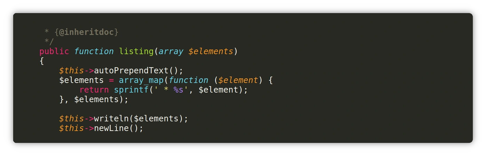
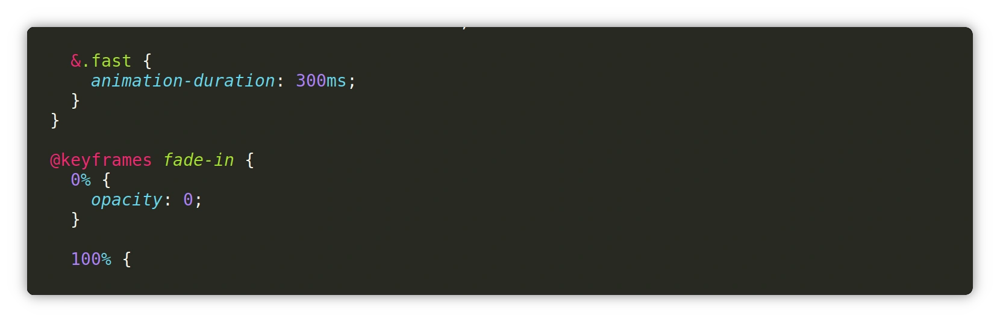

# Monokai Free

[](https://github.com/gerardroche/sublime-monokai-free/actions/workflows/ci.yml) [](https://ci.appveyor.com/project/gerardroche/sublime-monokai-free) [](https://packagecontrol.io/packages/MonokaiFree)

An enhanced version of the Monokai color scheme for Sublime Text.

## Installation

Install [MonokaiFree](https://packagecontrol.io/packages/MonokaiFree) via Package Control.

## Activate Scheme

```
Menu → Preferences → Select Color Scheme → MonokaiFree
Menu → Preferences → Select Color Scheme → MonokaiFreeBlue
```

## Activate Theme

```
Menu → Preferences → Select Theme → Adaptive
Menu → Preferences → Select Theme → Default Dark
Menu → Preferences → Select Theme → Default
```

**Settings**

Menu → Preferences → Settings

```js
"monokaifree.theme": true,
"monokaifree.vcs_status_labels": true,
"monokaifree.vcs_status_badges": true,
```

## Font Options

Menu → Preferences → Settings

```js
"font_options": [
    "no_bold",
    "no_italic"
],
```

```
// Valid options on all platforms are:
//  - "no_bold": Disables bold text
//  - "no_italic": Disables italic text
// Antialiasing options:
//  - "no_antialias": Disables antialiasing
//  - "gray_antialias": Uses grayscale antialiasing instead of subpixel
// Ligature options:
//  - "no_liga": Disables standard ligatures (OpenType liga feature)
//  - "no_clig": Disables contextual ligatures (OpenType clig feature)
//  - "no_calt": Disables contextual alternatives (OpenType calt feature)
//  - "dlig": Enables discretionary ligatures (OpenType dlig feature)
//  - "ss01": Enables OpenType stylistic set 1. Can enable sets 1 to 10
//        by changing the last two digits.
// Windows-only options:
//  - "directwrite": (default) Use DirectWrite for font rendering
//  - "gdi": Use GDI for font rendering
//  - "dwrite_cleartype_classic": Only applicable to "directwrite" mode,
//        should render fonts similar to traditional GDI
//  - "dwrite_cleartype_natural": Only applicable to "directwrite" mode,
//        should render fonts similar to ClearType "natural quality" GDI
//  - "subpixel_antialias": Force ClearType antialiasing when disabled
//        at system level
// Mac-only options:
//  - "no_round": Don't round glyph widths for monospace fonts when
//        "font_size" is small.
```

## Font

Try an alternative font.

| Font             | Repository                                                          | Description                                             |
|:---------------- |:------------------------------------------------------------------- |:------------------------------------------------------- |
| Fira Code        | [GitHub](https://github.com/tonsky/FiraCode)                        | Monospaced font with programming ligatures              |
| Cascadia Code    | [GitHub](https://github.com/microsoft/cascadia-code)                | Monospaced font designed for coding in Windows Terminal |
| Source Code Pro  | [GitHub](https://github.com/adobe-fonts/source-code-pro)            | Monospaced font aimed at coders and text editors        |
| Inconsolata      | [GitHub](https://github.com/google/fonts/tree/main/ofl/inconsolata) | Monospaced font for code listings and terminal use |
| Hack             | [GitHub](https://github.com/source-foundry/Hack)                    | Open-source monospaced font for developers              |
| JetBrains Mono   | [GitHub](https://github.com/JetBrains/JetBrainsMono)                | Typeface designed for coding, legible, and elegant      |
| Monoid           | [GitHub](https://github.com/larsenwork/monoid)                      | Unique coding font known for consistent shapes          |
| Hasklig          | [GitHub](https://github.com/i-tu/Hasklig)                           | Unique coding font known for consistent shapes

Menu → Preferences → Settings

```js
"font_face": "Fira Code",
```

## Customization

Menu → Preferences → Customize Color Scheme

```json
{
    "variables": {
        "bg0": "#292C3F",
    },
    "globals": {
        "caret": "yellow",
        "block_caret": "yellow",
        "block_caret_border": "yellow",
        "block_caret_corner_style": "square",
        "selection_corner_style": "square",
        "brackets_options": "foreground bold",
    },
    "rules": [

    ]
}
```

**Variables**

&nbsp;| COLOR     | HEX       | R   | G   | B   | Example usage
-----:|:----------|:----------|:----|:----|:----|:-------------
1     | bg0       | `#272822` |  39 |  40 |  34 | Background.
2     | bg1       | `#3e3d32` |  62 |  61 |  50 | Rulers, invisibles.
3     |           |           |     |     |     |
4     |           |           |     |     |     |
5     | fg0       | `#f8f8f2` | 248 | 248 | 242 | Text
6     | fg1       | `#cfcfc2` | 207 | 207 | 194 | Text (soft)
7     | fg2       | `#75715e` | 117 | 113 |  94 | Comments, selections, gutter text.
8     |           |           |     |     |     |
9     | yellow    | `#e6db74` | 230 | 219 | 116 | Strings, cursors.
10    | orange    | `#fd971f` | 253 | 151 |  31 | Language identifiers, function parameters.
11    | red       | `#f92672` | 249 |  38 | 114 | Control structures, modifiers, operators.
12    | magenta   | `#fd5ff0` | 253 |  95 | 240 | Errors, deprecations, notices.
13    | violet    | `#ae81ff` | 174 | 129 | 255 | Constants, numbers, booleans.
14    | blue      | `#66d9ef` | 102 | 217 | 239 | Built-in identifiers, declarations, functions.
15    | cyan      | `#a1efe4` | 161 | 239 | 228 |
16    | green     | `#a6e22e` | 166 | 226 |  46 | Class names, function names.

**Resources**

- [Sublime Text Color Schemes Documentation](https://www.sublimetext.com/docs/color_schemes.html#customization).

## Screenshots

> PHP



> CSS



> Javascript


Enhances support for

- [NeoVintageous](https://packagecontrol.io/packages/NeoVintageous): Vim for Sublime Text.
- [PHPUnitKit](https://packagecontrol.io/packages/PHPUnitKit): PHPUnit test runner for Sublime Text.
- [SublimeLinter](https://packagecontrol.io/packages/SublimeLinter): The code linting framework for Sublime Text.

## Contributing

Feel free to open GitHub Issues to report any problem or submit suggestions.  To run the tests install [ColorSchemeUnit](https://github.com/gerardroche/sublime-color-scheme-unit).

## License

Released under the [GPL-3.0-or-later License](LICENSE).
