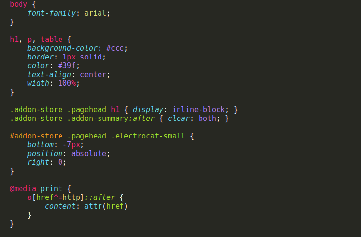
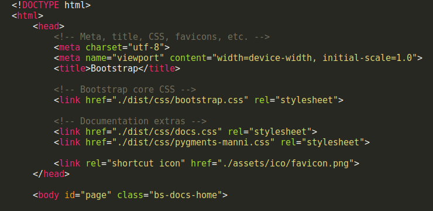
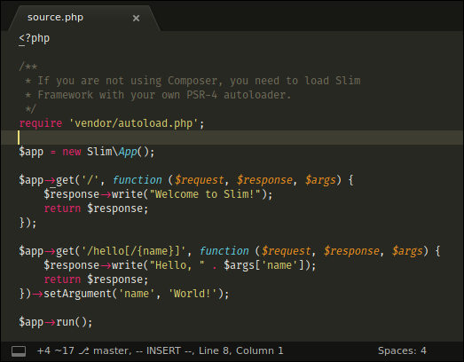
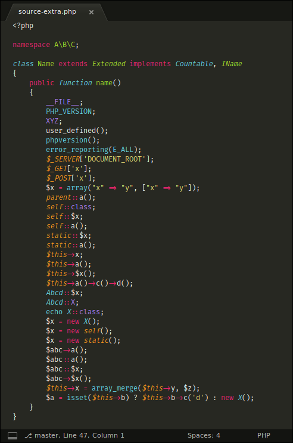
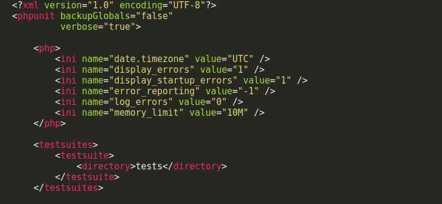
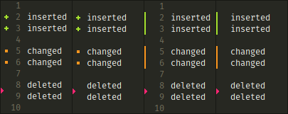
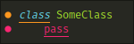

# MonokaiFree

A beautiful, modern, high quality, Monokai theme for Sublime Text 3.

[](https://travis-ci.org/gerardroche/sublime-monokai-free) [](https://ci.appveyor.com/project/gerardroche/sublime-monokai-free/branch/master) [](https://sublimetext.com) [](https://github.com/gerardroche/sublime-monokai-free/tags) [](https://github.com/gerardroche/sublime-monokai-free/stargazers) [](https://packagecontrol.io/packages/MonokaiFree) [](https://twitter.com/gerardroche)

* Enhanced syntax highlighting for PHP, HTML, CSS, Markdown, JavaScript, Ruby, Python.
* Additional syntax highlighting for LESS, Sass, Laravel Blade, Visual Studio Code.
* Supported plugins: [GitGutter][], [SublimeLinter][], [NeoVintageous][].

## INSTALLATION

### Package Control

The preferred method of installation is [Package Control](https://packagecontrol.io/browse/authors/gerardroche).

### Manual

Close Sublime Text then download or clone this repository to a directory named `MonokaiFree` in the Sublime Text Packages directory for your platform:

* Linux: `git clone https://github.com/gerardroche/sublime-monokai-free.git ~/.config/sublime-text-3/Packages/MonokaiFree`
* OSX: `git clone https://github.com/gerardroche/sublime-monokai-free.git ~/Library/Application\ Support/Sublime\ Text\ 3/Packages/MonokaiFree`
* Windows: `git clone https://github.com/gerardroche/sublime-monokai-free.git %APPDATA%\Sublime/ Text/ 3/Packages/MonokaiFree`

## ACTIVATE

Go to `Menu > Preferences > Color Scheme...` and select MonokaiFree.

## Screenshots

### CSS



### HTML



### PHP





### XML



### [GitGutter][]



### [SublimeLinter][]



## CONTRIBUTING

### Tests

To run the tests install [ColorSchemeUnit][] (a framework for testing Sublime Text color schemes), and run the `ColorSchemeUnit: Test Suite` command via the Command Palette (`Ctrl+Shift+P`).

### The Values

The colors are not set in stone. Please advice of better choices. There are also still two background and one foreground shades yet to be selected.


```text
COLOR TABLE

MONOKAIFREE HEX     RGB         EXAMPLE USAGE
*********** ******* *********** ********************************************
bg0         #272822  39  40  34
bg1         #3e3d32  62  61  50 Rulers, invisibles, line highlight.
bg2         ??????? ??? ??? ???
bg3         ??????? ??? ??? ???
fg0         #f8f8f2 248 248 242 Text
fg1         #cfcfc2 207 207 194 Text (soft)
fg2         #75715e 117 113  94 Comments, selections, gutter text.
fg3         ??????? ??? ??? ???
yellow      #e6db74 230 219 116 Strings, cursors.
orange      #fd971f 253 151  31 Language identifiers, function parameters.
red         #f92672 249  38 114 Control structures, modifiers, operators.
magenta     #fd5ff0 253  95 240
violet      #ae81ff 174 129 255 Constants, numbers, booleans.
blue        #66d9ef 102 217 239
cyan        #a1efe4 161 239 228
green       #a6e22e 166 226  46 Class names, function names.
```

## LICENSE

Released under the [BSD 3-Clause License](LICENSE).

[GitGutter]: https://github.com/jisaacks/GitGutter
[NeoVintageous]: https://github.com/NeoVintageous/NeoVintageous
[SublimeLinter]: https://github.com/SublimeLinter/SublimeLinter3
[ColorSchemeUnit]: https://github.com/gerardroche/sublime-color-scheme-unit
