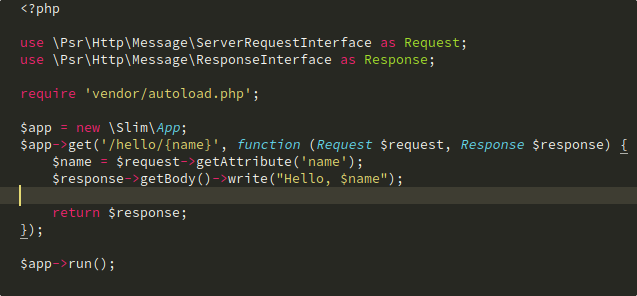

# MonokaiFree

A beautiful, professional, high quality, polished, free, Monokai color scheme for Sublime Text

[](https://travis-ci.org/gerardroche/sublime-monokai-free) [](https://sublimetext.com) [](https://github.com/gerardroche/sublime-monokai-free/tags) [](https://github.com/gerardroche/sublime-monokai-free/stargazers) [](https://packagecontrol.io/packages/MonokaiFree) [](https://twitter.com/gerardroche)

* Refined, and polished color palette
* Tested extensively using [ColorSchemeUnit](https://github.com/gerardroche/sublime_color_scheme_unit)
* Supported plugins: [GitGutter](https://github.com/jisaacks/GitGutter), [SublimeLinter](https://github.com/SublimeLinter/SublimeLinter3), [NeoVintageous](https://github.com/NeoVintageous/NeoVintageous)

Many Monokai color schemes available for Sublime Text are not kept up to date, don't support plugins, use too many variants of the same colors, or only exist to be compatible with a specific theme. They tend to go out of date and break in unexpected and unknown ways. [ColorSchemeUnit](https://github.com/gerardroche/sublime_color_scheme_unit), which is a testing framework for Sublime Text color schemes, helps improve the quality of color schemes and prevent regressions.



## INSTALLATION

### Package Control installation

The preferred method of installation is [Package Control](https://packagecontrol.io/browse/authors/gerardroche).

### Manual installation

1. Close Sublime Text.
2. Download or clone this repository to a directory named **`MonokaiFree`** in the Sublime Text Packages directory for your platform:
    * Linux: `git clone https://github.com/gerardroche/sublime-monokai-free.git ~/.config/sublime-text-3/Packages/MonokaiFree`
    * OS X: `git clone https://github.com/gerardroche/sublime-monokai-free.git ~/Library/Application\ Support/Sublime\ Text\ 3/Packages/MonokaiFree`
    * Windows: `git clone https://github.com/gerardroche/sublime-monokai-free.git %APPDATA%\Sublime/ Text/ 3/Packages/MonokaiFree`
3. Done!

## PALETTE


## THEMES

### [Gruvbox](https://github.com/Briles/gruvbox)

To make the tabs the same color as the Monokai color scheme background:

`Menu > Preferences > Browse Packages...`

Create a file based on the name of the gruvbox theme you are using e.g. if you are using `gruvbox (Dark) (Hard)` then create file named `gruvbox (Dark) (Hard).sublime-theme` in the `User` directory and add the following:

```
[
    // Make active tab bg the same as Monokai bg
    {
        "class": "tab_control",
        "attributes": [ "selected" ],
        "layer0.tint": [39, 40, 34]
    }
]
```

## CONTRIBUTING

Your issue reports and pull requests are always welcome.

### Tests

To run the tests: install [ColorSchemeUnit](https://github.com/gerardroche/sublime_color_scheme_unit), which a testing framework for ST color schemes, open the Command Palette, type "ColorSchemeUnit: Test Suite", and press Enter.

### Resources

* Emacs: [oneKelvinSmith/monokai-emacs](https://github.com/oneKelvinSmith/monokai-emacs)
* Emacs: [sjrmanning/darkokai](https://github.com/sjrmanning/darkokai) (dark variant)
* Atom: [kevinsawicki/monokai](https://github.com/kevinsawicki/monokai)
* Studio: [studiostyl.es/brighter-monokai-variant](http://studiostyl.es/schemes/brighter-monokai-variant)
* Terminal: [Mayccoll/Gogh](https://github.com/Mayccoll/Gogh/blob/master/content/themes.md#monokai-dark)
* Gruvbox: [morhetz/gruvbox](https://github.com/morhetz/gruvbox)

## LICENSE

Released under the [BSD 3-Clause License](LICENSE).
