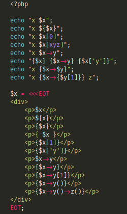
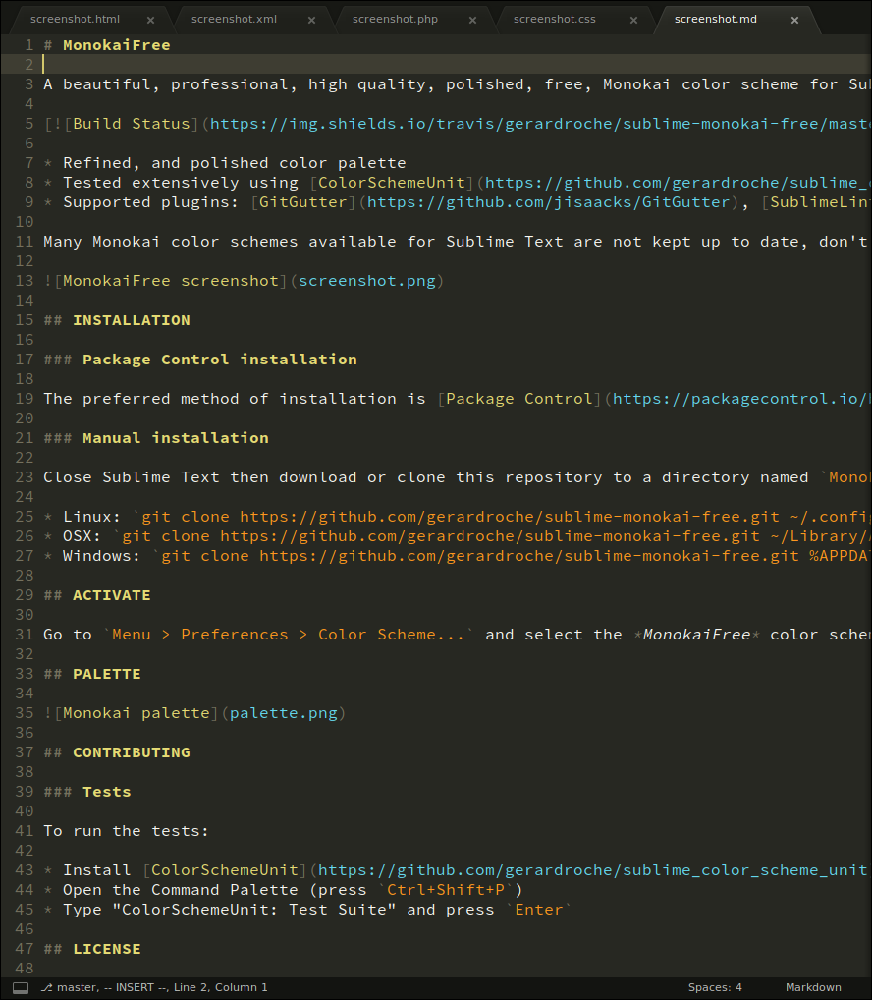

# MonokaiFree

A beautiful, modern, high quality, Monokai color scheme for Sublime Text 3.

[](https://travis-ci.org/gerardroche/sublime-monokai-free) [](https://sublimetext.com) [](https://github.com/gerardroche/sublime-monokai-free/tags) [](https://github.com/gerardroche/sublime-monokai-free/stargazers) [](https://packagecontrol.io/packages/MonokaiFree) [](https://twitter.com/gerardroche)

* Enhanced syntax highlighting for PHP, HTML, CSS, Markdown, JavaScript, Ruby, Python, and more.
* Additional syntax highlighting for LESS, Sass, Laravel Blade, Visial Studio Code, and more.
* Supported plugins: [GitGutter][], [SublimeLinter][], [NeoVintageous][], and more.


## INSTALLATION

### Package Control installation

The preferred method of installation is [Package Control](https://packagecontrol.io/browse/authors/gerardroche).

### Manual installation

Close Sublime Text then download or clone this repository to a directory named `MonokaiFree` in the Sublime Text Packages directory for your platform:

* Linux: `git clone https://github.com/gerardroche/sublime-monokai-free.git ~/.config/sublime-text-3/Packages/MonokaiFree`
* OSX: `git clone https://github.com/gerardroche/sublime-monokai-free.git ~/Library/Application\ Support/Sublime\ Text\ 3/Packages/MonokaiFree`
* Windows: `git clone https://github.com/gerardroche/sublime-monokai-free.git %APPDATA%\Sublime/ Text/ 3/Packages/MonokaiFree`

## ACTIVATE

Go to `Menu > Preferences > Color Scheme...` and select the MonokaiFree color scheme.

## Screenshots

The font used in the screenshots is [Fira Code][] (a monospaced font with programming ligatures):

`Menu > Preferences > Settings`

```json
{
    "font_face": "Fira Code",
    "font_size": 9
}
```

The theme used in the screenshots is Adaptive:

`Menu > Preferences > Settings`

```json
{
    "theme": "Adaptive.sublime-theme",
}
```

[GitGutter][] support:


`Menu > Preferences > Settings`

```json
{
    "git_gutter_show_in_minimap": 0,
    "git_gutter_show_markers_on_untracked_file": false,
    "git_gutter_show_status_bar_text": true,
    "git_gutter_status_bar_text": [
        "+{{inserted}} ",
        "~{{modified}} ",
        "-{{deleted}} ",
        "⎇ {{branch}}"
    ],
    "git_gutter_theme": "Bars.gitgutter-theme"
}
```

[SublimeLinter][] support:


PHP




Markdown



HTML


XML


## COLOR PALETTE


## CONTRIBUTING

### Tests

To run the tests:

* Install [ColorSchemeUnit][] (a framework for testing Sublime Text color schemes)
* Open the Command Palette (press `Ctrl+Shift+P`)
* Type "ColorSchemeUnit: Test Suite" and press `Enter`

## LICENSE

Released under the [BSD 3-Clause License](LICENSE).

[Fira Code]: https://github.com/tonsky/FiraCode
[GitGutter]: https://github.com/jisaacks/GitGutter
[NeoVintageous]: https://github.com/NeoVintageous/NeoVintageous
[SublimeLinter]: https://github.com/SublimeLinter/SublimeLinter3
[ColorSchemeUnit]: https://github.com/gerardroche/sublime-color-scheme-unit
