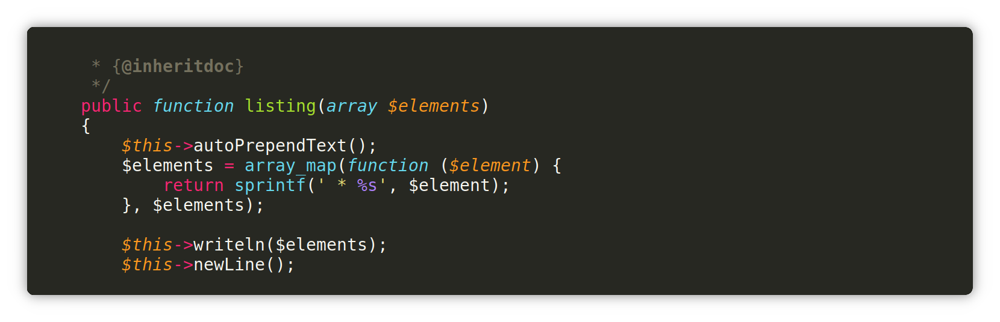
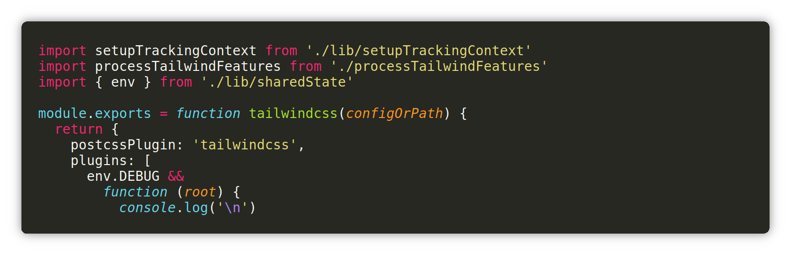
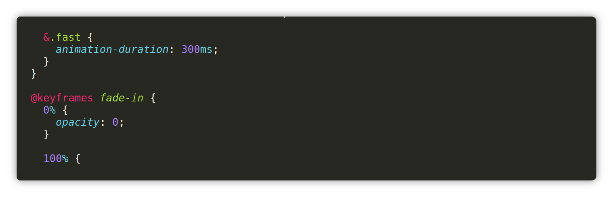

# MonokaiFree

<p>
    <a href="https://github.com/gerardroche/sublime-monokai-free/actions/workflows/ci.yml"></a>
    <a href="https://packagecontrol.io/packages/MonokaiFree"></a>
</p>

A beautiful, high quality, Monokai color scheme for Sublime Text. Enhanced syntax highlighting for serious developers. MonokaiFree is an improvement on the default Monokai color scheme in Sublime Text.

## Installation

Install MonokaiFree via [Package Control](https://packagecontrol.io/packages/MonokaiFree).

## Screenshots

> PHP



> Javascript



> CSS



## Customisations

To custom any color, create a color scheme override named "MonokaiFree.sublime-color-scheme" in your Sublime Text User directory (Menu &gt; Preferences &gt; Browse Packages).


Here is an example that makes the cursor yellow, selection square corner styles, and changes the foreground of some comments.

```json
{
    "globals": {
        "block_caret": "yellow",
        "caret": "yellow",
        "selection_corner_style": "square",
    },
    "rules":
    [
        {
            "scope": "comment, punctuation.definition.comment",
            "foreground": "#7e8e91"
        }
    ]
}
```

See the Sublime Text [Color Schemes documentation](https://www.sublimetext.com/docs/color_schemes.html) for full details of possible customisations.

## Contributing

Feel free to open GitHub Issues to report any problem or submit suggestions. To run the tests install [ColorSchemeUnit](https://github.com/gerardroche/sublime-color-scheme-unit) (a framework for testing Sublime Text colour schemes), and run the ColorSchemeUnit: Test Suite command via the Command Palette.
